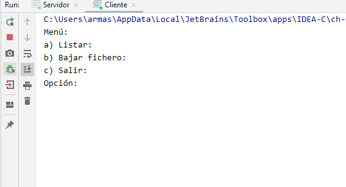

# App Artxibo Zerbitzua

App Artxibo Zerbitzua 0.1 es una aplicación de consola para la recepción de archivos utilizando
la arquitectura cliente/servidor.

Está desarralloda mediante el lenguaje de programación de Java 8 y con el enterno de desarrollo de 
IntelliJ IDEA Community 2019.

### Estructura del programa

El programa está estructurado en dos archivos java Cliente y Servidor los cuales se comportan como
dos objetos con sus correspondientes atributos, constructores y métodos.

A parte se utilizan dos directorios, directoriocliente y directorioservidor que son donde guardan sus 
archivos.

### Cliente

El Cliente va a tener la funcionalidad de interactuar con el usuario mediante un menú para que seleccione
la opción deseada y asi realizar las peticiones requeridas al servidor.

### Servidor

El Servidor tendrá la misión de recibir las peticiones del Cliente y enviarle/comunicarle lo requerido.

### Video tutorial

[Ver el video tutorial](https://youtu.be/3CyEX90E7zE)

